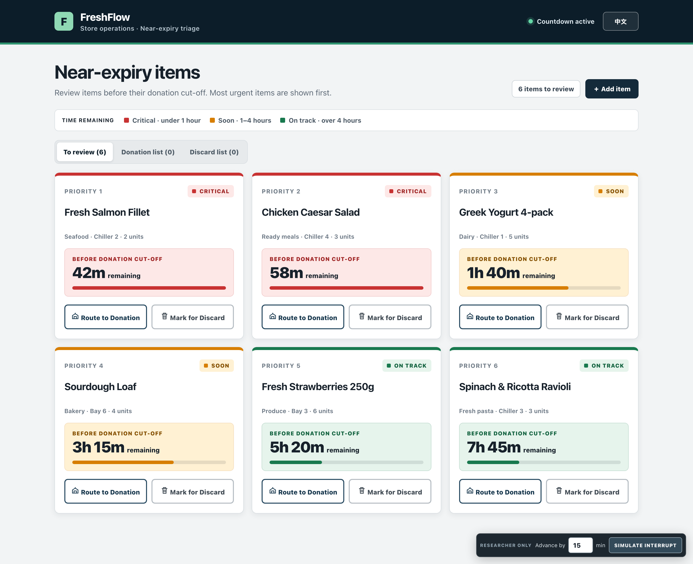
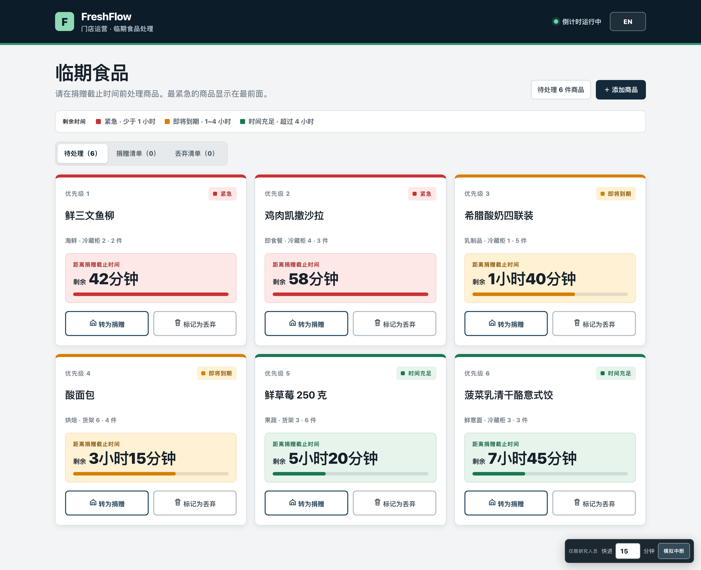

# FreshFlow — Near-Expiry Triage

A single-page, Wizard-of-Oz prototype for a **DECO6500** usability pilot. It puts supermarket staff in front of the decision they actually face on the shop floor: which near-expiry items still have time to reach a donation partner, and which have run out of it.

Everything runs from one self-contained `index.html` — no build step, dependency, server, login, API, or database.



---

## Run it

Open `index.html` in any modern browser (Chrome, Edge, Safari or Firefox). That is the whole setup.

The prototype makes **no network requests of any kind** — no CDN, no web fonts, no analytics — so it runs identically on a laptop with the Wi-Fi switched off. This matters for a pilot session: nothing can stall or look broken mid-task.

All state lives in the page. **Refreshing resets the scenario to its starting condition**, which is how you reset between participants.

---

## The interface

### Header and orientation

A fixed brand bar (`FreshFlow · Store operations · Near-expiry triage`) carries a "Countdown active" status dot, so participants can tell at a glance that time is genuinely running, and the language switcher.

Below it, an always-visible **urgency key** spells out the three time bands in words, so the colour coding never has to be inferred:

| Band | Label | Time remaining | Colour |
| --- | --- | --- | --- |
| Red | **Critical** | Under 1 hour | `#c83232` |
| Amber | **Soon** | 1–4 hours | `#a05a00` |
| Green | **On track** | Over 4 hours | `#18794e` |

### Item cards

Items are re-sorted by remaining time on every render, so the most urgent card is always first and carries a **Priority 1** rank badge. Each card shows the item name, a `category · location · quantity` meta line, a large countdown under the label "Before donation cut-off", and a coloured urgency bar.

Urgency is carried four ways at once — rank number, badge text, colour, and bar length — so the list stays readable for participants with colour vision deficiency and survives being viewed at arm's length.

One deliberate detail: **the bar length encodes the band, not the exact proportion** (100% / 66% / 34%). It is a categorical cue that reinforces the badge, not a second, competing precision readout of the number already shown above it.

Countdowns round up to the minute (`42m`, `1h 40m`, `3h`). Once a countdown reaches zero the card reads **Cut-off reached**.

### Making a decision

Each pending card offers **Route to Donation** and **Mark for Discard**. On click the card locks, shows a `✓ Marked for Donation` (or Discard) confirmation, and after a short beat moves out of the review queue into its list. The queue counter and all three tab counts update immediately.

### Three lists

| Tab | Contents | Actions available |
| --- | --- | --- |
| **To review** | Undecided items, most urgent first | Route to Donation · Mark for Discard |
| **Donation list** | Everything routed to donation | Edit item · Return to review |
| **Discard list** | Everything marked for discard | Edit item · Return to review |

Because a decision is reversible from its list, a participant who mis-taps is not stuck — and the researcher can observe whether they notice and recover, which is itself a finding.

### Adding and editing items

**＋ Add item** opens a modal (native `<dialog>`) with item name, a **category** dropdown (10 options: produce, dairy, bakery, seafood, meat, ready meals, fresh pasta, deli, frozen, other), a **location** dropdown (14 options: chillers 1–4, freezers 1–2, bays 1–6, back room, service desk), quantity (1–999), and remaining time as separate hours (0–72) and minutes (0–59) fields.

Incomplete or zero-time entries are refused with an inline error rather than silently accepted. A new item is inserted into the correct rank by remaining time, announced to screen readers, and smooth-scrolled into view so the researcher can confirm it landed.

**Edit item**, available from the donation and discard lists, reopens the same dialog pre-filled and adds a **List status** field — so an item can be corrected, re-timed, or moved between review, donation and discard without touching the source file. This is what lets a researcher shape a scenario live, mid-session, in front of the participant.

### CSV export

In the donation or discard list, **↓ Export current list** downloads that list as a CSV: item name, category, location, quantity, remaining time and status. Files are named `freshflow-donation-list-YYYY-MM-DD.csv` (or `-discard-`).

The export is written as UTF-8 with a byte-order mark and CRLF line endings, which is what makes Chinese item names open correctly in Excel rather than as mojibake. Headers and status values follow the currently selected language.

### Bilingual interface

A single header button switches the entire interface between **English and Simplified Chinese** — headings, labels, dropdown options, buttons, urgency bands, dialog copy, error messages, screen-reader announcements, CSV headers, the page `<title>`, and the document `lang` attribute. The six seeded items carry both an English and a Chinese name.

Chinese time strings follow Chinese convention (`1小时40分钟`, with 剩余 leading rather than trailing), rather than being English strings with the words swapped.



> **Note for researchers:** an item whose name you type or edit yourself is stored with that one string for both languages. Only the six seeded items are genuinely bilingual. If a session will switch languages, seed the items you need in advance rather than typing them live.

---

## The interruption condition

The prototype is built around a scripted *"a customer interrupts you"* test condition — the situation where a paper prototype or a static mockup falls apart, because time has to keep moving while the participant is not looking.

A dark **researcher dock** sits in the bottom-right corner: `Researcher only · Advance by [15] min · Simulate interrupt`.

1. **Simulate interrupt** raises a full-screen overlay reading *"Customer approaching… Pause this task and assist the customer."* The list is covered, page scrolling is locked, and the countdown loop is suspended. The button becomes **Resume**.
2. **Resume** adds the configured minutes (0–240) to the simulated clock and returns to the list.

**Why the resume looks seamless.** Remaining time is derived, never stored as a ticking value: each card computes `item.seconds − elapsed − simulatedOffsetSeconds` on demand. Resuming adds to that single offset and re-renders *before* the overlay is removed, so the first frame the participant sees already carries correct numbers. There is no visible reset, no counter rewinding, and no reflow — the system simply appears to have kept track while their back was turned.

Cards re-sort and change colour band on resume if the skip warrants it, exactly as they would have done had the participant watched the time pass.

---

## Default scenario

Two Critical, two Soon and two On track items at load. Times are relative to page load, so every participant meets the identical scenario regardless of when their session runs.

| # | Item | 中文名 | Category | Location | Qty | Remaining | Band |
| --- | --- | --- | --- | --- | --- | --- | --- |
| 1 | Fresh Salmon Fillet | 鲜三文鱼柳 | Seafood | Chiller 2 | 2 | 42m | Critical |
| 2 | Chicken Caesar Salad | 鸡肉凯撒沙拉 | Ready meals | Chiller 4 | 3 | 58m | Critical |
| 3 | Greek Yogurt 4-pack | 希腊酸奶四联装 | Dairy | Chiller 1 | 5 | 1h 40m | Soon |
| 4 | Sourdough Loaf | 酸面包 | Bakery | Bay 6 | 4 | 3h 15m | Soon |
| 5 | Fresh Strawberries 250g | 鲜草莓 250 克 | Produce | Bay 3 | 6 | 5h 20m | On track |
| 6 | Spinach & Ricotta Ravioli | 菠菜乳清干酪意式饺 | Fresh pasta | Chiller 3 | 3 | 7h 45m | On track |

The 42m and 58m pairing is deliberate: two items in the same red band, close enough together that a participant has to actually read the numbers rather than rely on colour alone to order them.

**To change the scenario permanently**, edit the `items` array near the top of the `<script>` block; `seconds` is the time remaining at page load. **To change it for one session only**, use ＋ Add item and Edit item in the running page — no code, no reload.

---

## Research focus

The prototype is instrumented for three evaluation questions:

1. Can a participant identify the item with the least time remaining, unprompted?
2. After an interruption, can they correctly read — and trust — the updated remaining time?
3. Does explicit donation-window information change their confidence in the donate-versus-discard decision?

A suggested session shape: let the participant clear two or three items, trigger the interrupt during their fourth, resume with a 15–30 minute skip, and observe whether they re-check the countdowns or resume from memory.

---

## Accessibility

Built to be usable in the pilot by participants who rely on assistive technology, and to keep the visual design honest:

- Semantic landmarks, a real `<dialog>`, and an ARIA tablist for the three lists
- A live region announcing every decision, addition, edit, restore, export and resume
- Focus moved deliberately — into the dialog on open, back to the triggering control on close
- Visible focus rings on all interactive elements; `.sr-only` labels on the compound time inputs
- Colour never the sole carrier of urgency (rank, badge text and bar length carry it too)
- Text colours chosen to hold contrast against their tinted card backgrounds
- `prefers-reduced-motion` respected — transitions and smooth scrolling are cut

## Responsive layout

Three-column grid on a laptop, two columns at ≤900px, single column at ≤620px, where the header sheds secondary text and the researcher dock spans the full width so it stays reachable one-handed.

## Scope

Deliberately excluded, to keep the pilot focused on the triage decision itself: authentication, real API or database integration, donation-partner coordination, manager and corporate dashboards, multi-store support, and real-time sync.

## Files

```
index.html              complete self-contained prototype
README.md               this file
docs/screenshot.png     English interface
docs/screenshot-zh.png  Simplified Chinese interface
```
